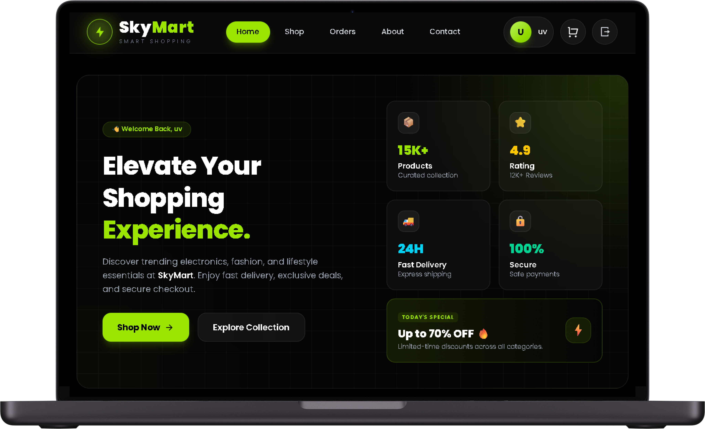
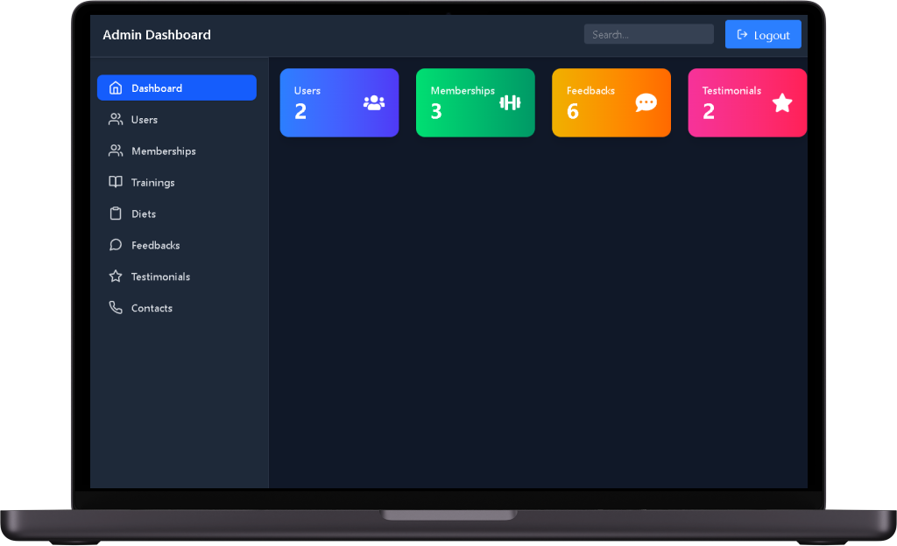
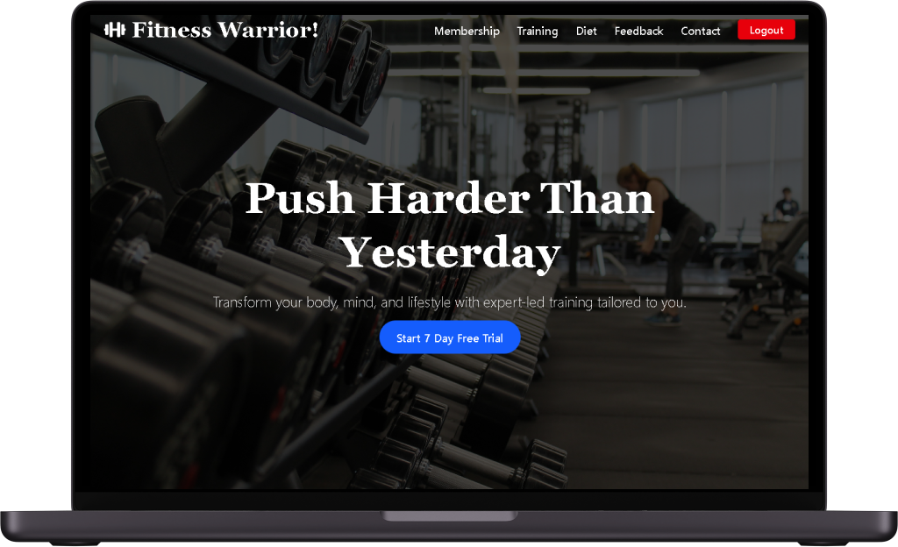
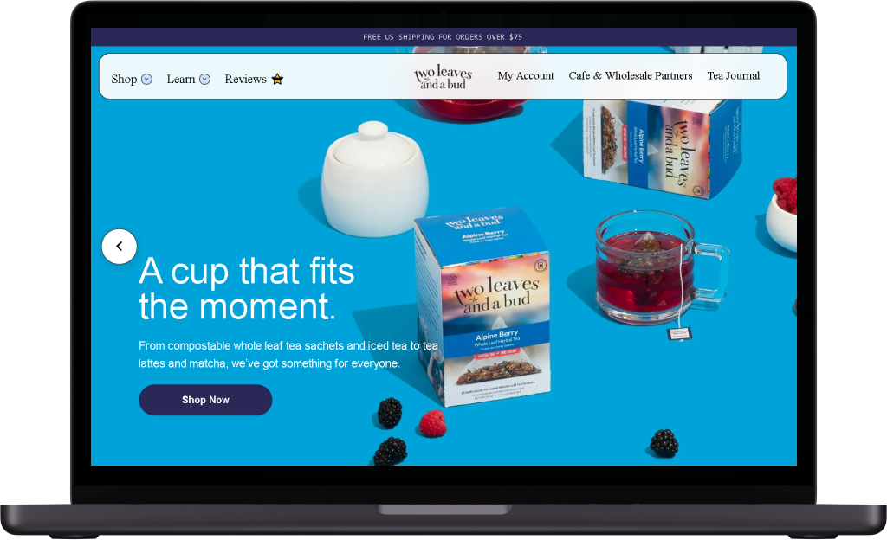
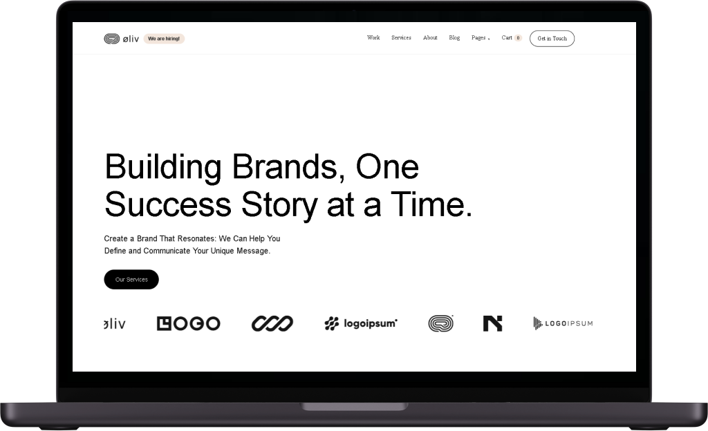
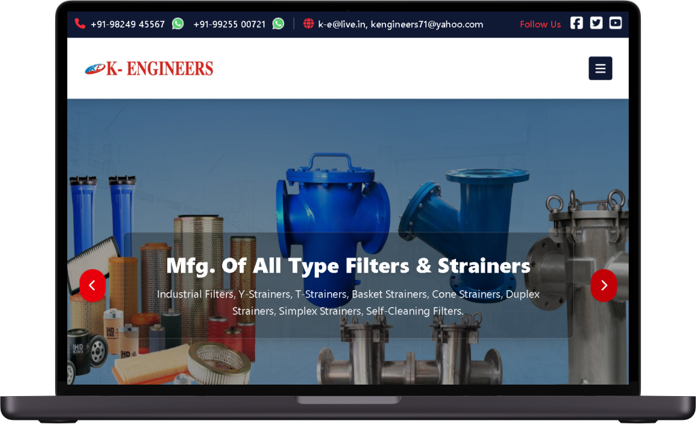
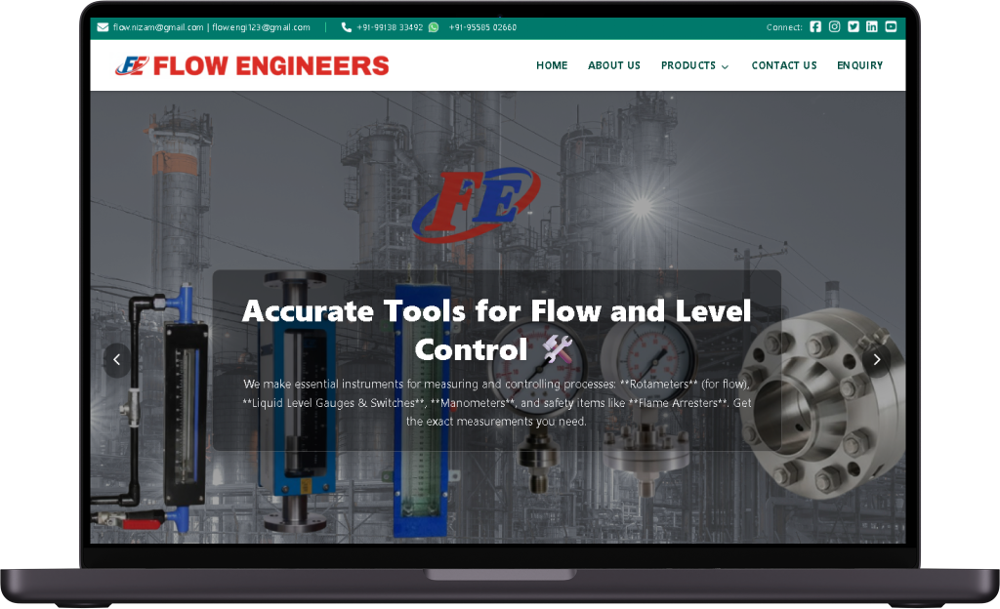
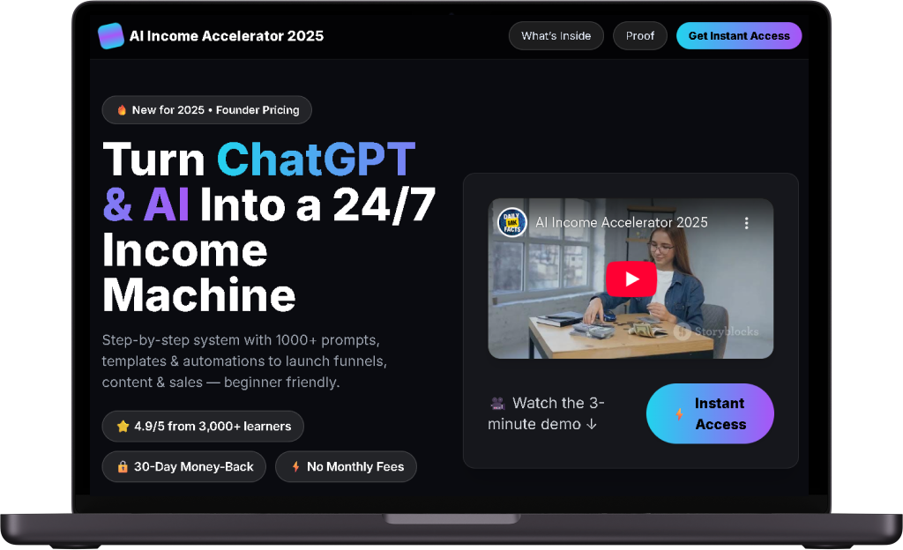

<div align="center">


 # 🚀 Welcome to My GitHub


<p>

<a href="https://github.com/Mahmaduvesh">

</a>

<a href="https://www.linkedin.com/in/mahmaduvesh-khalifa-b48ba41a0">

</a>

<a href="https://uv-pf.netlify.app/">

</a>

<a href="mailto:khalifamahmaduvesh@gmail.com">

</a>

</p>

</div>

---

#  About Me


🎓 MCA Gold Medalist & Academic Excellence Award Winner

🥇 Ranked **#1 among 80+ MCA Students**

💻 Full Stack Software Engineer from India

🚀 Passionate about building scalable web applications

⚛️ Specialized in the MERN Stack

🌱 Currently learning

- Next.js
- TypeScript
- Docker
- AWS
- System Design

💡 Love solving real-world problems through clean code.

---

# 🌐 Portfolio

<div align="center">

### 🚀 Explore My Work

<a href="https://uv-pf.netlify.app/">


</a>

### 🌍 https://uv-pf.netlify.app/

</div>

---

# 🛠 Tech Stack

<div align="center">


</div>

---

<!-- # 💼 Professional Experience

### 💻 Full Stack Software Engineer

- Develop responsive web applications
- Design REST APIs
- Build scalable backend systems
- Optimize application performance
- Follow clean architecture

---

### 👨‍🏫 Technical Mentor

Helping students learn

- HTML
- CSS
- JavaScript
- React.js
- Node.js
- Express.js
- MongoDB
- Git & GitHub

through real-world projects.

--- -->

# 🚀 What I Do

✔ Frontend Development

✔ Backend Development

✔ REST API Development

✔ Database Design

✔ Authentication & Authorization

✔ Responsive UI Development

✔ Performance Optimization

✔ Deployment & Hosting

---

# 🏆 Achievements

🥇 MCA Gold Medalist

🏅 Academic Excellence Award

🥇 Ranked #1 among 80+ MCA Students

🚀 MERN Stack Developer

💻 Full Stack Software Engineer

🌟 Passionate Lifelong Learner

---

# 🌱 Currently Exploring


- Next.js

- Docker

- AWS

- TypeScript

- System Design

---

# 🚀 Featured Projects

<table>

<tr>

<td width="50%" valign="top">

## 🛍️ SkyMart - Modern React E-Commerce



A modern and fully responsive **E-Commerce Web Application** built with **React.js**, **Vite**, **Tailwind CSS**, and **Context API**. SkyMart delivers a complete online shopping experience with secure authentication, shopping cart management, Razorpay payment integration, order history, and detailed order tracking.

### ✨ Features

- 🛒 Product Browsing
- ❤️ Wishlist
- 🛍 Shopping Cart
- 💳 Razorpay Payment Integration
- 📦 Order History
- 🔐 Authentication
- 📱 Fully Responsive Design

### 🌐 Live Demo

🔗 https://sky-mart-uv.netlify.app/


### 🛠 Tech Stack

`React.js`
`Vite`
`Tailwind CSS`
`Context API`
`JavaScript`
`Razorpay`

</td>

<td width="50%" valign="top">

## 🏋️ Gym Management System - Admin



A powerful **Admin Dashboard** for managing gym operations with a clean dark-themed interface. The system provides complete CRUD functionality for managing members, memberships, trainers, diet plans, and training programs while displaying real-time dashboard statistics.

### 🔥 Features

- 👥 User Management
- 💳 Membership Management
- 🏋️ Training Management
- 🥗 Diet Management
- 📊 Dashboard Analytics
- 🔍 Search & Filters
- ⚡ CRUD Operations

### 🌐 Live Demo

🔗 https://gym-sys-uv.netlify.app/admin-auth

### 🛠 Tech Stack

`React.js`
`Tailwind CSS`
`Node.js`
`Express.js`
`MongoDB`
`JavaScript`

</td>

</tr>

<tr>

<td width="50%" valign="top">

## 💪 Gym Management System - User



A modern and responsive user portal for **Fitness Warrior**, allowing members to manage memberships, explore personalized workout plans, access diet guides, and interact seamlessly with backend APIs for dynamic content.

### ✨ Features

- 👤 User Dashboard
- 💳 Membership Plans
- 🏋️ Training Programs
- 🥗 Diet Plans
- 📅 User Profile
- 📱 Responsive UI
- ⚡ API Integration

### 🌐 Live Demo

🔗 https://gym-sys-uv.netlify.app/user-login

### 🛠 Tech Stack

`React.js`
`Tailwind CSS`
`Node.js`
`Express.js`
`MongoDB`
`JavaScript`

</td>

<td width="50%" valign="top">

## 🍃 Two Leaves Tea



A pixel-perfect clone of the original **Two Leaves Tea** website built completely from scratch using clean HTML, CSS, and JavaScript. The project accurately replicates the original design while maintaining excellent responsiveness and smooth user interactions.

### ✨ Features

- 🎨 Pixel Perfect UI
- 📱 Fully Responsive
- ⚡ Smooth Animations
- 🌟 Hover Effects
- 💻 Clean Semantic Code
- 🚀 Fast Performance

### 🌐 Live Demo

🔗 https://a5-task-2tea.netlify.app/

### 🛠 Tech Stack

`HTML5`
`CSS3`
`JavaScript`

</td>

</tr>

</table>

---

<table>

<tr>

<td width="50%" valign="top">

## 🫒 Oliv Landing Page



A modern and pixel-perfect landing page recreated from scratch using **HTML, CSS, and JavaScript**. The project closely matches the original design while maintaining excellent responsiveness, smooth animations, and interactive user experience across all devices.

### ✨ Features

- 🎨 Pixel Perfect Design
- 📱 Fully Responsive
- ⚡ Smooth Animations
- 🌟 Hover Effects
- 💻 Clean & Semantic Code
- 🚀 Optimized Performance

### 🌐 Live Demo

🔗 https://a5-task-2-oliv.netlify.app/

### 🛠 Tech Stack

`HTML5`
`CSS3`
`JavaScript`

</td>

<td width="50%" valign="top">

## 🏭 K Engineers



A fully responsive industrial catalog website developed for **K Engineers**, showcasing Industrial Valves, Hydraulic Equipment, and Process Control Instruments. Designed with a clean UI/UX to effectively present complex product information while improving customer engagement and lead generation.

### ✨ Features

- 📱 Mobile Friendly
- 🎨 Professional UI/UX
- 📋 Product Catalog
- 📩 Contact & Enquiry Forms
- ⚡ Fast Loading
- 🌍 SEO Friendly

### 🌐 Live Demo

🔗 https://k-engineering.netlify.app/

### 🛠 Tech Stack

`React.js`
`Tailwind CSS`
`JavaScript`

</td>

</tr>

<tr>

<td width="50%" valign="top">

## ⚙️ Flow Engineers



A professional static website developed for **Flow Engineers**, specializing in control instruments. Built with a modern React architecture and responsive design to present technical products clearly while ensuring a seamless browsing experience across all devices.

### ✨ Features

- 📱 Responsive Layout
- ⚡ High Performance
- 🏭 Industrial Product Showcase
- 📋 Product Catalog
- 🎨 Modern UI
- 🌍 Professional Business Website

### 🌐 Live Demo

🔗 https://flow-engineers.netlify.app/

### 🛠 Tech Stack

`React.js`
`Tailwind CSS`
`JavaScript`

</td>

<td width="50%" valign="top">

## 🤖 AI Income Accelerator 2025 - VSL



A high-converting **Video Sales Letter (VSL)** landing page created for the **AI Income Accelerator 2025** campaign. The page promotes an AI-powered passive income system with engaging copywriting, compelling CTAs, and a conversion-focused layout designed to maximize user engagement.

### ✨ Features

- 🚀 High-Converting Landing Page
- 🎯 Sales Funnel Design
- 📱 Fully Responsive
- ⚡ Fast Loading
- 💰 Conversion Optimized
- 🎨 Modern UI

### 🌐 Live Demo

🔗 https://aiincomeaccelerator.com/vsl/

### 🛠 Tech Stack

`React.js`
`Tailwind CSS`
`JavaScript`

</td>

</tr>

</table>

---


# 📚 Education

🎓 **Master of Computer Applications (MCA)**

🥇 Gold Medalist

🏆 Academic Excellence Award Winner

🥇 Ranked #1 among 80+ Students

---

# 💡 Soft Skills

✔ Leadership

✔ Communication

✔ Problem Solving

✔ Team Collaboration

✔ Critical Thinking

✔ Time Management

✔ Continuous Learning

---

# 🌱 2026 Goals

🎯 Master Next.js

🎯 Learn Cloud Computing

🎯 Master AWS

🎯 Build Production-Level SaaS Applications

🎯 Contribute to Open Source

🎯 Solve 500+ DSA Problems

🎯 Become Senior Software Engineer

---

# 💻 Development Workflow

```text
💡 Idea
   │
   ▼
🎨 UI Design
   │
   ▼
⚛ React Development
   │
   ▼
🚀 Node.js API
   │
   ▼
🗄 MongoDB Database
   │
   ▼
☁ Deployment
```

---

# 🤝 Let's Connect

<div align="center">

<a href="https://github.com/Mahmaduvesh">

</a>

<a href="https://www.linkedin.com/in/mahmaduvesh-khalifa-b48ba41a0">

</a>

<a href="mailto:khalifamahmaduvesh@gmail.com">

</a>

<a href="https://uv-pf.netlify.app/">

</a>

</div>

---

# 💬 Developer Quote

<div align="center">

> **"First, solve the problem. Then, write the code."**  
> — John Johnson

</div>

---

# ☕ Support My Work

<div align="center">

If you enjoy my work and would like to support me, consider buying me a coffee! ☕

<a href="https://buymeacoffee.com/mahmaduvesh">


</a>

</div>

---

<div align="center">


# Thanks for Visiting ❤️

### ⭐ If you like my work, don't forget to follow me on GitHub!


</div>